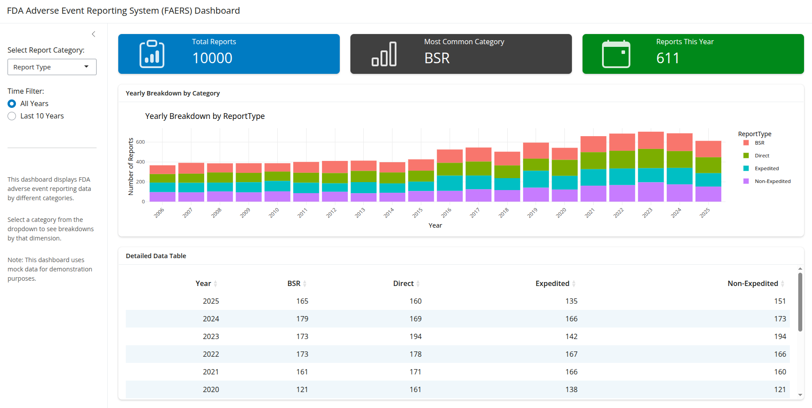

# FAERS Public Dashboard (Shiny App)

## Overview
This Shiny application is a mock **FDA Adverse Event Reporting System (FAERS) Public Dashboard**, built using `shiny`, with data visualization powered by `ggplot2` and `plotlly`. 
The app provides an interactive interface for exploring FAERS data, using mocked data for demonstration purposes. 
The app is live on *shinyapps.io* and can be accessed [here](https://adsoncostanzi.shinyapps.io/shiny-tiny-hackathon/).



## Features
### 1. **Dynamic Filtering with Category Selector**
Users can filter reports by selecting different categories:
- **Report Type:** BSR, Direct, Expedited, Non-Expedited
- **Reporter Type:** Consumer, Healthcare, Not Specified, Other
- **Reporter Region:** Domestic, Foreign, Not Specified
- **Report Seriousness:** Death, Non-Serious, Serious
- **Age Group:** Various age brackets
- **Sex:** Female, Male, Not Specified

### 2. **Interactive Data Visualization**
- **Bar Chart**
  - Y-axis: Count of occurrences
  - X-axis: Year
  - Breakdown based on selected category
- **Time Filter Buttons**
  - "All Years": Displays full dataset
  - "Last 10 Years": Filters data for the last decade

### 3. **Data Table**
- Displays yearly report counts per category.
- Each row represents a year, each column represents a category, and each cell contains the respective count.

### 4. **Summary Boxes**
- Displays three key summary metrics.

## Technology Stack
- **Shiny Assistant**: Used to build and enhance this Shiny application
- `shiny`: Interactive web application framework for R
- `ggplot2`: Library for creating visualizations
- `plotly`: Library for creating interactive plots
- `DT`: Library for creating interactive data tables
- `dplyr`: Library for data manipulation


## Installation & Usage
1. Ensure you have R following packages installed.
2. Install required dependencies:

```r
   install.packages(c("shiny", "bslib", "dplyr", "ggplot2", "plotly", "DT"))
```

## Run the Shiny app:
```r
   shiny::runApp("app.R")
```

## Author & Credits

This application was built using [Shiny Assistant](https://gallery.shinyapps.io/assistant/), an AI-powered tool for accelerating Shiny app development.


